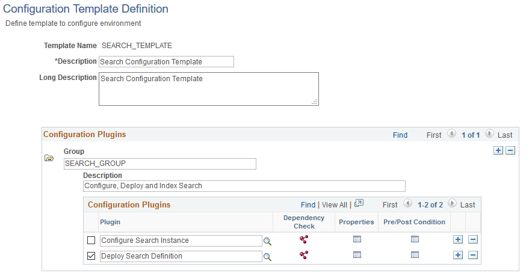
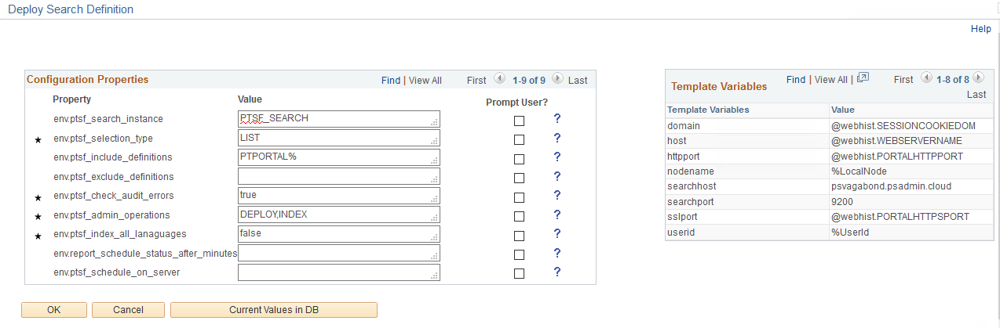

!SLIDE center subsection blue

# What is the ACM?

!SLIDE bullets

# Automated Configuration Management

* PeopleSoft Cloud Architecture
  1. Deployment Packages
  1. Automate Configuration Management
* DPK => Servers
* ACM => Database

~~~SECTION:notes~~~
The ACM is one half of the PCA; DPK is the other half

~~~ENDSECTION~~~

!SLIDE bullets

# Automated Configuration Management

* ACM is an App Engine - PTEM_CONFIG
* ACM Plugins are Application Packages
* ACM Templates define configuration
* Configuration is stored:
  1. Database
  1. Properties file
  1. YAML

!SLIDE bullets

# ACM Releases

* Beta product in 8.53
* PIA Configuration in 8.54
* DPK Integration in 8.55
* Additional Plugins in 8.56

~~~SECTION:notes~~~
The ACM started out as a beta product in 8.53. There were limited options, and you could only use a properties file. You had to call the ACM via the command line with `psae`.

8.54 introduced the PIA application to configure ACM templates. You could also test and run the ACM from the PIA along with the command line. This was the big release for ACM.

With 8.55, the ACM was bundle into the DPK to become the PeopleSoft Cloud Architecture. It was leveraged for PeopleSoft Image deployments to configure the IB, Report Nodes, Web Profile and more. 

8.56 didn't introduce any big changes to ACM, but there are new plugins and can show that the ACM platform is stabilizing. The big gap now is to build up the list of Plugins
~~~ENDSECTION~~~

!SLIDE bullets incremental

# ACM Advantages

* ACM Plugins are PeopleCode and SQL
* Access to IB, Search and more
* Define configuration in database
* Run via command line and PIA
* Write your own plugins

!SLIDE bullets incremental

# ACM Limitations

* Plugins designed for PeopleSoft Images
* Not all configuration available in ACM
* Delivered plugins are not idempotent

~~~SECTION:notes~~~
The plugins work well in the PI build, but that doesn't always work for you. 
Missing some functionality with ACM plugins.
ACM plugins are not idempotent - something that is important when running the ACM via the DPK
~~~ENDSECTION~~~

!SLIDE bullets

# ACM Scope

* PeopleTools
    1. Integration Broker
    1. Search Framework
    1. Process Scheduler
    1. More!
* Application
    1. AWE Configuration
    1. URLs
    1. ePro
    1. More!

!SLIDE bullets

# ACM Plugins

* Plugins are App Packages
    1. SQL
    1. PeopleCode
    1. Component Interfaces

!SLIDE bullets incremental

# ACM Templates

* Templates stored in database
* Logical groups of configuration
* Secure templates by Permission List

~~~SECTION:notes~~~
Templates are a PL security item, so you could offer template access to some users. Maybe you have an ePro ACM plugin that functional users can run to reset config after testing.
~~~ENDSECTION~~~

!SLIDE bullets

# ACM Templates

Navigate PeopleTools > Automated Config Manager > ACM Templates > Template Definition

~~~SECTION:notes~~~
The templates let you group plugins how you see best. You can include a single plugin, or multiple plugins in multiple groups.
~~~ENDSECTION~~~

!SLIDE bullets

# ACM Templates

~~~SECTION:notes~~~
Each plugin has properties you fill out. This is the configuration the ACM will apply.

On the right-hand side, you can see the variables available to the ACM template.
~~~ENDSECTION~~~

!SLIDE bullets

# ACM Security

* ACM Templates are configured on Permission Lists
* `PTPT4800` is the delivered PL
* Custom templates must be added to PL
* Component Interfaces

~~~SECTION:notes~~~
CI's are used heavily in the ACM. The delivered plugins that use CI's should have the CI in `PTPT4800`.
~~~ENDSECTION~~~

!SLIDE bullets

# ACM Processing

There are two types of ACM Plugins: 

1. Preboot Plugins
1. Postboot Plugins

Preboot plugins can be run at anytime and do not require a running domain.

Postboot plugins require a running domain (web and app servers).

!SLIDE center subsection grey

# Demo

~~~SECTION:notes~~~
Show how to configure an ACM template for Elasticsearch

The demo password for ES is `Passw0rd!`

1. Create a new Template: `HCMWIN_CONFIG` (use this name for powershell script)
1. Add in ConfigureSearchInstance and DeploySearch plugins
1. Configure the plugins
1. Add security to custom template
1. Test and run the template

~~~ENDSECTION~~~